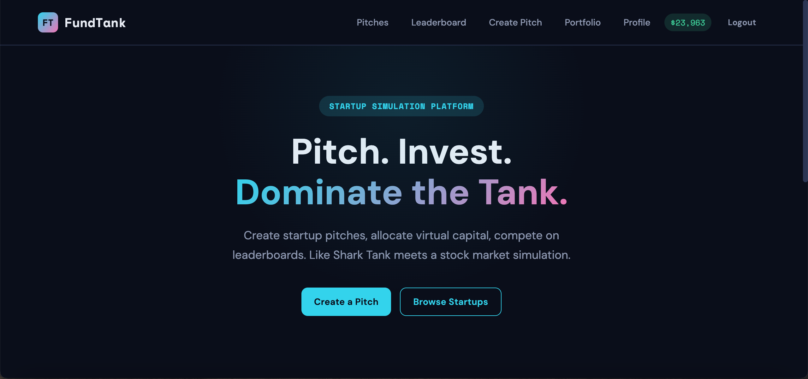
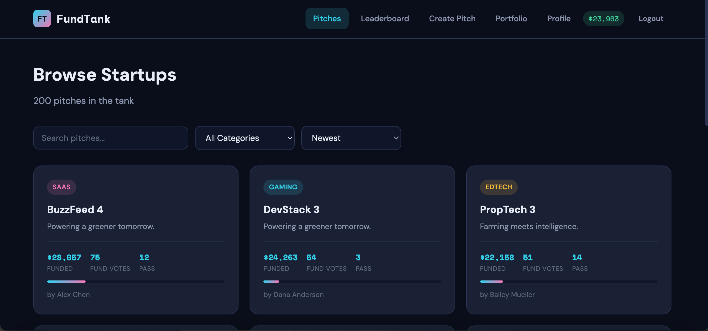
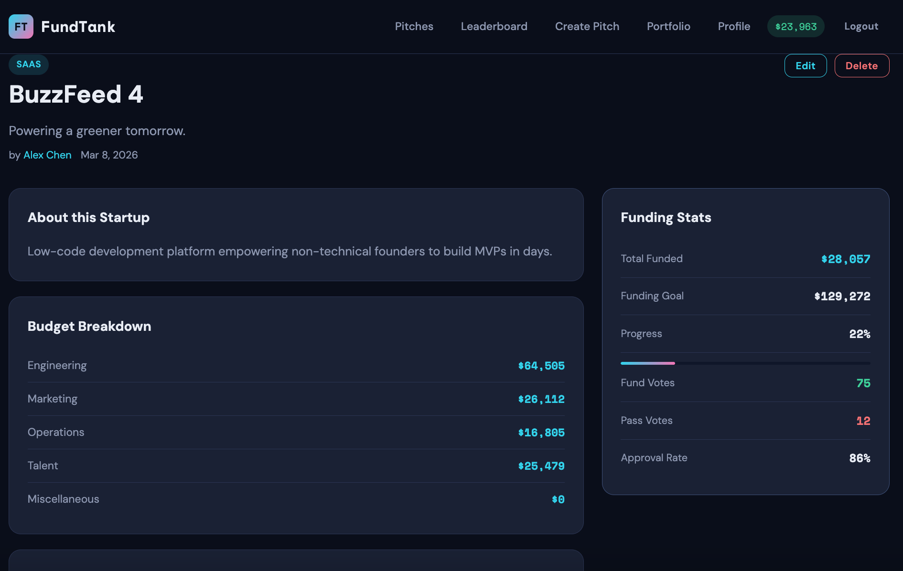
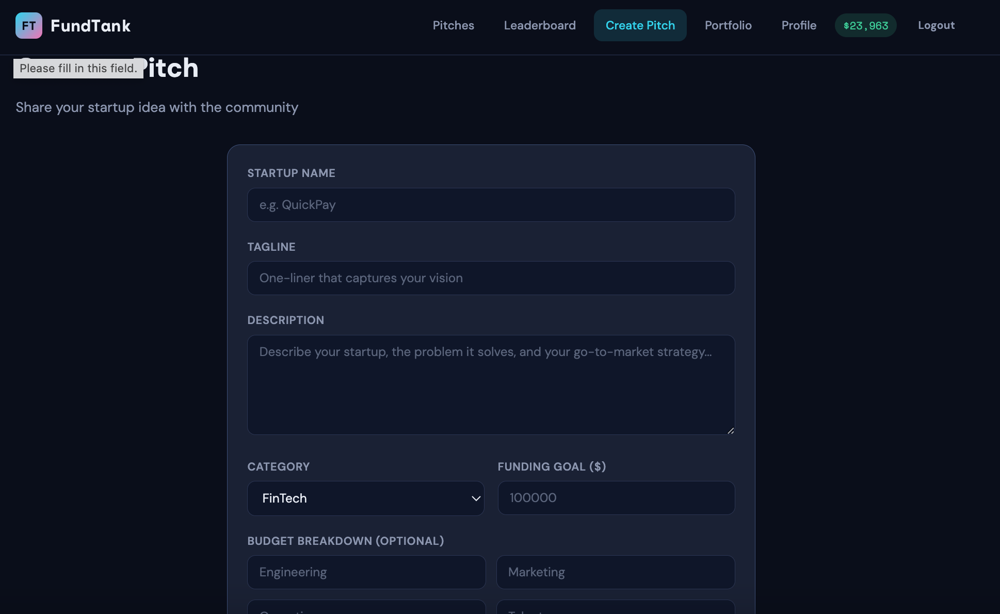
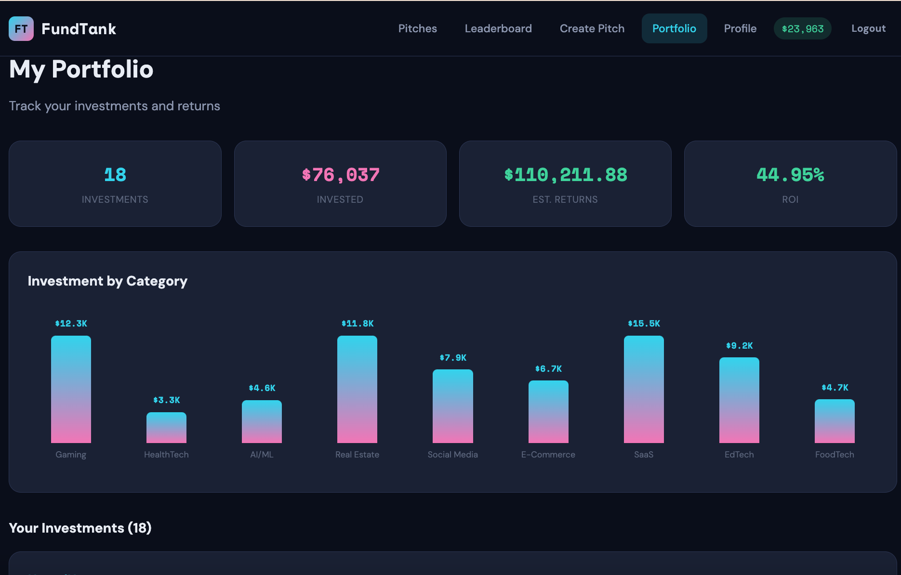
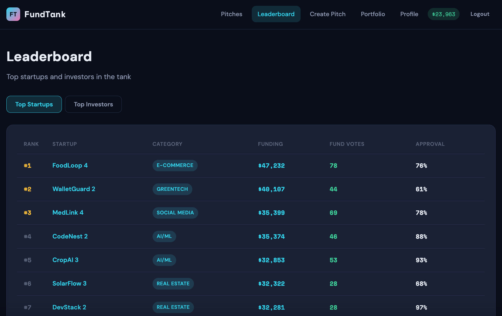
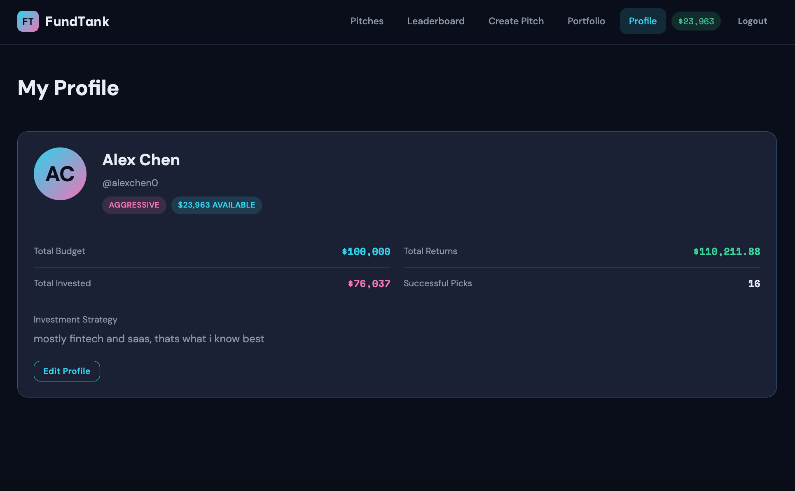
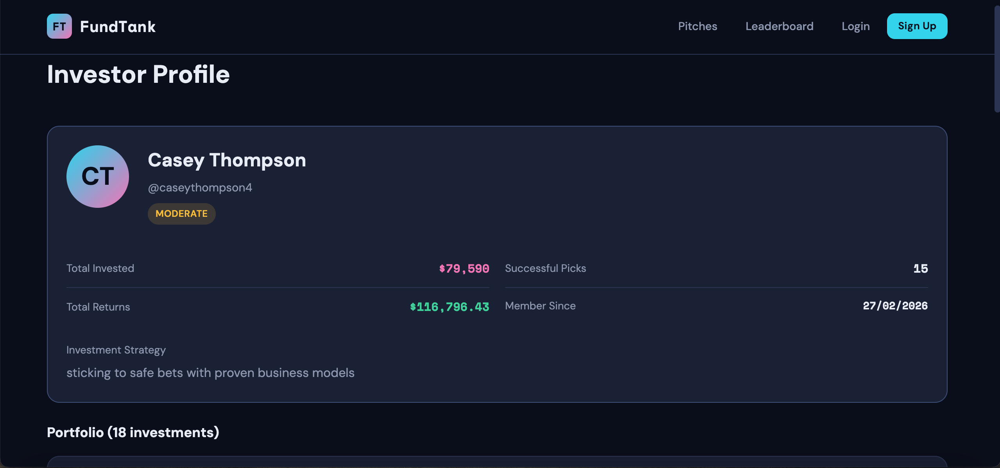
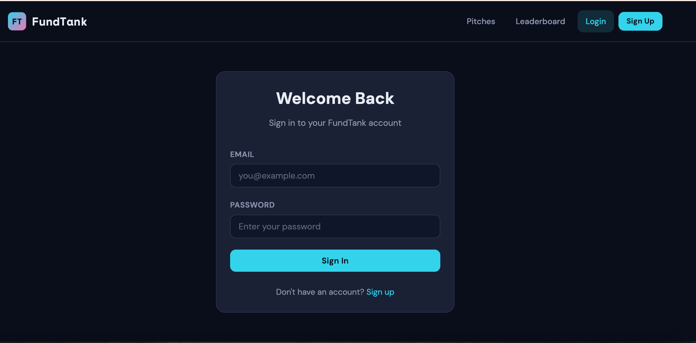
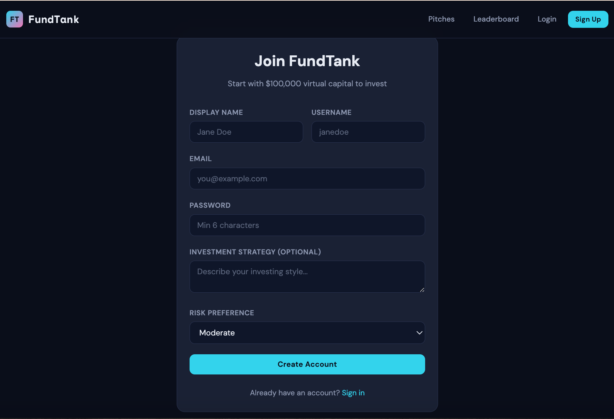

# FundTank Design Document

## 1. Project Overview

FundTank is a startup simulation platform where users roleplay as entrepreneurs and investors in a fictional startup ecosystem. The platform creates a gamified experience around startup culture, combining pitch creation, community voting, virtual investment, and competitive leaderboards.

## 2. User Personas

### Aspiring Entrepreneur ("Raj")
Has creative business ideas but no real world platform to test them. Wants to pitch concepts, get community feedback, and see how investors react. Raj uses FundTank to practice crafting compelling pitches and learn what resonates with potential backers.

### Strategic Investor ("Lena")
Loves analyzing business models and making calculated bets. Wants to build a portfolio of startups and compare performance against other investors. Lena uses FundTank to sharpen her investment instincts and climb the investor leaderboard.

### Casual Browser ("Sam")
Enjoys reading creative pitches and voting on favorites. Not deeply into strategy but likes participating and seeing which startups rise to the top. Sam uses FundTank to browse interesting ideas and cast Fund/Pass votes.

## 3. User Stories

### Startup Pitches & Voting (Kashish Rahulbhai Khatri)

1. As an entrepreneur, I want to create a startup pitch with a name, description, category, and budget breakdown, so investors can evaluate my idea.
2. As an entrepreneur, I want to edit or delete my startup pitches, so I can refine my proposals.
3. As a user, I want to browse and filter startup pitches by category and popularity, so I can discover interesting ventures.
4. As a user, I want to vote on startup pitches (fund / pass), so I can influence which startups get funded.
5. As an entrepreneur, I want to view my pitch's stats including total votes, funding received, and investor comments, so I can gauge community reception.
6. As a user, I want to see a leaderboard of top ranked startups by funding secured and vote ratio, so I can follow the competition.

### Investment Portfolio & Analytics (Abhimanyu Dudeja)

1. As a new user, I want to create an investor profile with a display name, investment strategy description, and risk preference, so others can see my investing style.
2. As an investor, I want to allocate fake currency from my budget into startups, so I can build a portfolio.
3. As an investor, I want to view my portfolio showing all my investments and current returns, so I can track my performance.
4. As an investor, I want to leave comments and notes on startup pitches, so entrepreneurs get feedback and other investors see my analysis.
5. As a user, I want to view any investor's profile with their portfolio history and total returns, so I can compare strategies.
6. As a user, I want to see a global investor leaderboard ranked by returns and successful picks, so I can find the top performing investors.

## 4. Design Mockups

### 4.1 Home Page



The home page features a prominent hero section with the tagline "Pitch. Invest. Dominate the Tank." and two CTAs (Get Started / Explore Pitches). Below the hero, a stats bar displays four metric cards showing Active Pitches, Investors, Total Funded, and Investments Made. The bottom section showcases the top 3 funded startups as clickable pitch cards, each showing category badge, name, funding amount, fund votes, a progress bar toward the funding goal, and the author name.

### 4.2 Browse Pitches (Pitch List)



The browse page has a page header showing total pitch count, followed by a filter row with a search input, category dropdown (All Categories, FinTech, HealthTech, etc.), and sort dropdown (Newest, Oldest, Most Funded, Most Votes). Below, pitches display in a responsive 3 column grid of PitchCard components. Each card shows category badge, startup name, funding amount, fund/pass vote counts, a progress bar, and author name. Pagination controls at the bottom show Previous/Next buttons and current page info.

### 4.3 Pitch Detail



The pitch detail page uses a two column layout. The left column contains the pitch header (category badge, name, tagline, author, date), an About card with the full description, a Budget Breakdown card listing line items (Engineering, Marketing, Operations, Talent, Miscellaneous) with dollar amounts, and a Q&A/Comments section with a textarea for posting, threaded comments showing author name, date, comment text, Author badges for pitch creator replies, and Reply/Edit/Delete actions. The right sidebar has a Funding Stats card showing Total Funded, Funding Goal, Progress bar with percentage, Fund Votes (green), Pass Votes (red), and Approval Rate. Below stats are the Fund (green) and Pass (red) vote buttons. An Invest card at the bottom has Amount input, Notes textarea, and Invest button.

### 4.4 Create / Edit Pitch



The pitch form page has a centered card containing fields for Startup Name (text input), Tagline (text input), Description (textarea, 5 rows), a row with Category (select dropdown with 12 options) and Funding Goal (number input), and an optional Budget Breakdown section with five number inputs (Engineering, Marketing, Operations, Talent, Miscellaneous). At the bottom are Create Pitch (primary cyan button) and Cancel (ghost button). In edit mode, the heading changes to "Edit Pitch" and fields are pre populated.

### 4.5 Portfolio



The portfolio page opens with four stat cards in a row showing Investments count (cyan), Total Invested (pink), Estimated Returns (green), and ROI percentage (green/red based on positive/negative). Below is an Investment by Category bar chart card with vertical bars for each category the user has invested in. The main section lists all investments as horizontal cards, each showing the pitch name (clickable link), notes or investment date, dollar amount invested, estimated return with multiplier, and Edit/Withdraw action buttons. The Withdraw button triggers a confirmation modal overlay.

### 4.6 Leaderboard



The leaderboard has two tab buttons at the top: Top Startups (active, cyan highlight) and Top Investors. The startups tab shows a table card with columns for Rank (#1, #2, #3 highlighted gold), Startup name (clickable cyan link), Category (colored badge), Funding amount (cyan), Fund Votes (green), and Approval percentage. The investors tab (when selected) shows Rank, Investor name (clickable), Strategy description (truncated), Total Returns (green), Picks count, and Risk preference badge (green/amber/pink for conservative/moderate/aggressive).

### 4.7 Profile (Own)



The profile page shows a card with an avatar circle (initials), display name, username, risk preference badge, and available budget badge. Below are stats in a 2 column grid: Total Budget, Total Invested, Total Returns, and Successful Picks. If the user has an investment strategy, it displays as a text paragraph. An Edit Profile button opens an inline edit form with Display Name input, Investment Strategy textarea, Risk Preference dropdown (Conservative/Moderate/Aggressive), and a Save Changes button.

### 4.8 User Profile (Public)



The public profile page mirrors the own profile layout but without edit capabilities. It shows the investor's avatar, display name, username, risk badge, stats (Total Invested, Total Returns, Successful Picks, Member Since), and strategy text. Below is a list of their public portfolio investments showing pitch name, notes/date, amount, and estimated return for each investment.

### 4.9 Login / Register




The login page has a centered card with "Welcome Back" heading, subtitle, Email input, Password input, and a full width Sign In button. A footer links to the register page. The register page card is wider and includes Display Name and Username in a row, Email, Password (min 6 chars), Investment Strategy textarea (optional), Risk Preference dropdown, and a full width Create Account button. Footer links back to login. Both pages redirect to home if user is already authenticated.

## 5. Architecture

### Tech Stack

- **Frontend:** React 18 with React Router v6, bundled with Vite
- **Backend:** Node.js with Express
- **Database:** MongoDB (Atlas cloud hosted)
- **Authentication:** JWT tokens with bcrypt password hashing

### System Diagram

```
Browser (React SPA)
    |
    | HTTP/JSON (REST API)
    |
Express Server (Node.js)
    |
    | MongoDB Driver
    |
MongoDB Atlas (4 Collections)
```

### Data Flow

1. User interacts with React frontend
2. Frontend calls REST API endpoints via fetch (centralized in api.js)
3. Express routes validate input, check auth via JWT middleware, perform DB operations
4. MongoDB stores and returns data
5. Frontend updates state and re renders

## 6. Database Schema

### users Collection
```
{
  _id: ObjectId,
  username: String (unique),
  email: String (unique),
  password: String (bcrypt hashed),
  displayName: String,
  strategy: String,
  riskPreference: "conservative" | "moderate" | "aggressive",
  budget: Number (starts at 100000),
  totalInvested: Number,
  totalReturns: Number,
  successfulPicks: Number,
  createdAt: Date,
  updatedAt: Date
}
```

### pitches Collection
```
{
  _id: ObjectId,
  name: String,
  tagline: String,
  description: String,
  category: String (one of 12 categories),
  budgetBreakdown: { engineering, marketing, operations, talent, miscellaneous },
  fundingGoal: Number,
  totalFunding: Number,
  fundVotes: Number,
  passVotes: Number,
  voters: [{ userId: ObjectId, vote: "fund"|"pass", votedAt: Date }],
  authorId: ObjectId,
  authorName: String,
  status: "active",
  createdAt: Date,
  updatedAt: Date
}
```

### investments Collection
```
{
  _id: ObjectId,
  investorId: ObjectId,
  investorName: String,
  pitchId: ObjectId,
  pitchName: String,
  amount: Number,
  notes: String,
  returnMultiplier: Number,
  estimatedReturn: Number,
  status: "active",
  createdAt: Date,
  updatedAt: Date
}
```

### comments Collection
```
{
  _id: ObjectId,
  pitchId: ObjectId,
  pitchName: String,
  authorId: ObjectId,
  authorName: String,
  text: String,
  parentId: ObjectId | null (for threaded replies),
  isAuthorReply: Boolean,
  createdAt: Date,
  updatedAt: Date
}
```

## 7. API Endpoints

### Authentication
| Method | Endpoint | Description |
|--------|----------|-------------|
| POST | /api/auth/register | Create new user account |
| POST | /api/auth/login | Authenticate and get JWT token |
| GET | /api/auth/me | Get current user from token |

### Pitches
| Method | Endpoint | Description |
|--------|----------|-------------|
| GET | /api/pitches | Browse pitches with filters, search, pagination |
| GET | /api/pitches/leaderboard | Top 20 pitches by funding |
| GET | /api/pitches/:id | Get single pitch details |
| POST | /api/pitches | Create a new pitch (auth required) |
| PUT | /api/pitches/:id | Update own pitch (auth required) |
| DELETE | /api/pitches/:id | Delete own pitch (auth required) |
| POST | /api/pitches/:id/vote | Vote fund or pass (auth required) |

### Investments
| Method | Endpoint | Description |
|--------|----------|-------------|
| GET | /api/investments | Get current user's portfolio (auth required) |
| GET | /api/investments/user/:userId | View any user's investments |
| GET | /api/investments/:id | Get single investment |
| GET | /api/investments/analytics/summary | Portfolio analytics (auth required) |
| POST | /api/investments | Invest in a startup (auth required) |
| PUT | /api/investments/:id | Update investment notes/amount (auth required) |
| DELETE | /api/investments/:id | Withdraw investment (auth required) |

### Users
| Method | Endpoint | Description |
|--------|----------|-------------|
| GET | /api/users/leaderboard | Top 20 investors by returns |
| GET | /api/users/:id | View user public profile |
| PUT | /api/users/profile | Update own profile (auth required) |

### Comments
| Method | Endpoint | Description |
|--------|----------|-------------|
| GET | /api/comments/pitch/:pitchId | Get all comments for a pitch |
| POST | /api/comments | Create comment or reply (auth required) |
| PUT | /api/comments/:id | Edit own comment (auth required) |
| DELETE | /api/comments/:id | Delete own comment (auth required) |

## 8. React Components

The app uses 13 React components, each in its own file with a corresponding CSS module:

| Component | Purpose | Key Props |
|-----------|---------|-----------|
| App | Root component, routing, auth state | none |
| Navbar | Navigation bar, user status, budget display | user, onLogout |
| Home | Landing page, hero, stats, featured pitches | user |
| Login | Email/password login form | onLogin |
| Register | Account creation with investor profile setup | onLogin |
| PitchList | Browse pitches with filters, search, pagination | user |
| PitchCard | Individual pitch card (reusable) | pitch, rank |
| PitchDetail | Full pitch view, voting, investing, comments | user, refreshUser |
| PitchForm | Create/edit pitch form | user |
| Portfolio | User's investment portfolio with analytics | user, refreshUser |
| Leaderboard | Tabbed startup and investor rankings | none |
| Profile | Current user's own profile with edit form | user, setUser |
| UserProfile | Public view of any investor's profile | none (uses URL param) |
| Comments | Threaded comments section for pitches | pitchId, user |

All components that receive props define PropTypes for validation.

## 9. Visual Design

### Typography
- **Primary font:** DM Sans (400, 500, 600, 700 weights) for all body text, headings, and UI elements
- **Monospace font:** Space Mono (400, 700) for financial figures and code like accents
- Both loaded from Google Fonts

### Color Palette
- **Background primary:** #0a0e1a (deep navy)
- **Background card:** #1a2035 (slightly lighter navy)
- **Text primary:** #e8ecf4 (light gray)
- **Text secondary:** #8b95b0 (muted gray)
- **Accent cyan:** #22d3ee (primary actions, links, brand)
- **Accent pink:** #f472b6 (secondary highlights, invested amounts)
- **Accent green:** #34d399 (positive states, fund votes, returns)
- **Accent amber:** #fbbf24 (moderate risk, warnings)
- **Accent red:** #f87171 (destructive actions, pass votes, cancel)

### Color Consistency
- **Approval/positive:** Green (#34d399) used consistently for Fund votes, positive returns, successful picks
- **Cancel/destructive:** Red (#f87171) used consistently for Pass votes, delete buttons, withdrawal, danger actions
- **Primary CTA:** Cyan (#22d3ee) for all primary buttons (Sign In, Create Pitch, Invest, Save)
- **Secondary CTA:** Outlined cyan for secondary actions (Browse, Edit)

### Layout Principles
- Top left hierarchy: Brand logo and primary navigation in the top left corner
- Hero section is the most salient element on the home page
- Cards provide consistent visual containers across all pages
- Responsive grid system (3 column, 2 column, single column breakpoints)
- Consistent spacing using 8px base grid (padding: 24px cards, 20px gaps)

## 10. Accessibility

- All form inputs have associated `<label>` elements with htmlFor attributes
- Interactive card components (PitchCard) include role="button", tabIndex={0}, and onKeyDown handlers for keyboard navigation
- Semantic HTML: `<nav>`, `<main>`, `<form>`, `<button>`, `<table>`, `<thead>`, `<tbody>`, `<section>`, `<h1>` through `<h3>`
- Buttons are actual `<button>` elements, not styled divs or spans
- Links use `<a>` tags via React Router's `<Link>` component
- Focus visible states on all interactive elements via CSS transitions
- Form validation using HTML5 required, minLength, and type attributes

## 11. Security

- Passwords hashed with bcrypt (10 salt rounds)
- JWT tokens for stateless authentication (7 day expiry)
- MongoDB credentials stored in environment variables via dotenv
- `.env.example` provided with safe placeholder values
- Server side authorization checks on all protected routes (ownership verification for edit/delete)
- Input validation on both client and server side
- CORS configured to only allow specific origins

## 12. Seed Data

The seed script (`npm run seed`) generates 1200+ synthetic records across all 4 collections to demonstrate the app at scale. This includes 50 users with varied risk preferences and strategies, 200 pitches across 12 categories with realistic vote distributions, 800+ investments respecting budget constraints, and 150+ threaded comments. All generated data uses realistic names, descriptions, and financial figures.