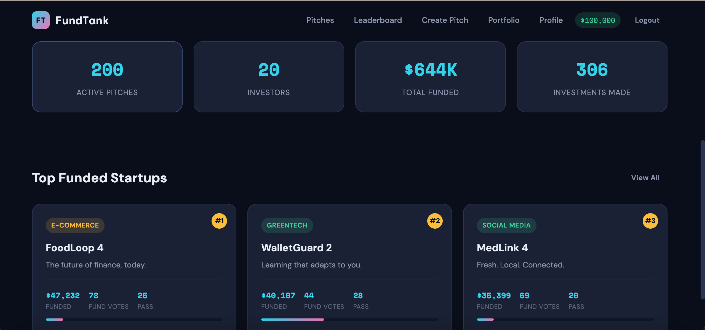

# FundTank - Startup Simulation Platform



## Authors
- **Abhimanyu Dudeja** - Investment Portfolio & Analytics
- **Kashish Rahulbhai Khatri** - Startup Pitches & Voting

## Class
[CS5610 - Web Development, Northeastern University](https://johnguerra.co/classes/webDevelopment_spring_2026/)

## Project Objective
FundTank is a startup simulation platform where users roleplay as entrepreneurs and investors in a fictional startup ecosystem. Entrepreneurs create startup pitches with business plans, categories, and budget breakdowns. Investors receive $100,000 in virtual currency to allocate across startups and vote on which ventures deserve funding. Startups are ranked by total funding and community votes, while investors compete on a leaderboard based on returns and successful picks.

Think of it as **Shark Tank meets a stock market game** — making startup culture accessible and fun.

## Features
- **Create Startup Pitches** - Name, description, category, budget breakdown, funding goal
- **Browse & Filter** - Search pitches by category, sort by funding/votes/date
- **Vote** - Fund or Pass on pitches to influence community rankings
- **Invest** - Allocate virtual currency from your $100K budget into startups
- **Portfolio** - Track all investments, estimated returns, and ROI
- **Analytics** - Category breakdown chart showing investment distribution
- **Leaderboards** - Top startups by funding, top investors by returns
- **User Profiles** - View any investor's portfolio and strategy

## Tech Stack
- **Frontend**: React 18 (with hooks), React Router, Vite
- **Backend**: Node.js, Express
- **Database**: MongoDB (native driver)
- **Auth**: JWT with bcrypt
- **Deployment**: Render

## Instructions to Build

### Prerequisites
- Node.js 18+
- MongoDB (local or Atlas)

### Setup

1. Clone the repository:
```bash
git clone https://github.com/your-repo/fundtank.git
cd fundtank
```

2. Install backend dependencies:
```bash
cd backend
npm install
```

3. Configure environment variables:
```bash
cp .env.example .env
# Edit .env with your MongoDB URI and JWT secret
```

4. Seed the database (1000+ records):
```bash
npm run seed
```

5. Start the backend:
```bash
npm run dev
```

6. In a new terminal, install and start the frontend:
```bash
cd frontend
npm install
npm run dev
```

7. Open http://localhost:5173

### Test Account
After seeding: `alex.chen0@example.com` / `password123`

## Design Decisions
- **No Mongoose** - Uses native MongoDB driver per course requirements
- **No Axios** - Uses native fetch API
- **No CORS library** - Manual CORS headers in Express middleware
- **JWT Auth** - Stateless authentication with 7-day token expiry
- **Dark Theme** - Modern, polished UI with cyan/pink accent colors
- **PropTypes** - Defined for every React component
- **CSS per component** - Each component has its own CSS file

## Deployment
Deployed on Render: [https://fundtank.onrender.com](https://fundtank.onrender.com)

## Video Demo
[Watch on YouTube](https://youtube.com/your-video-link)

## License
MIT
